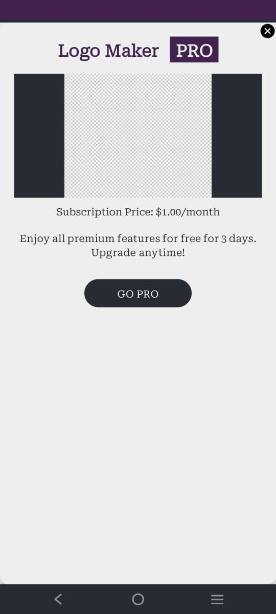
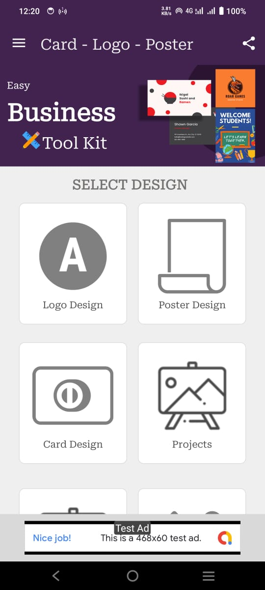
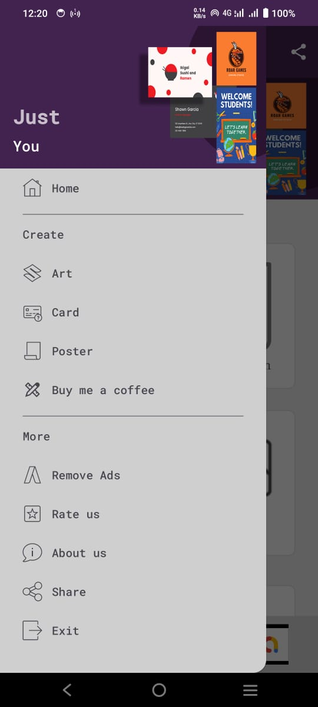
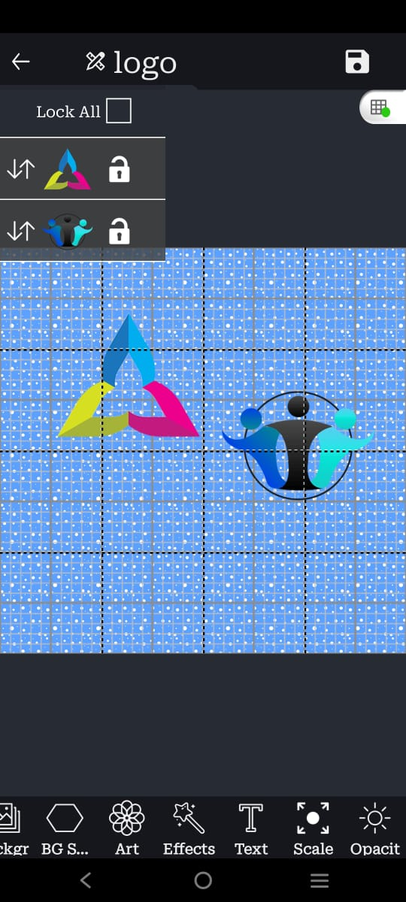
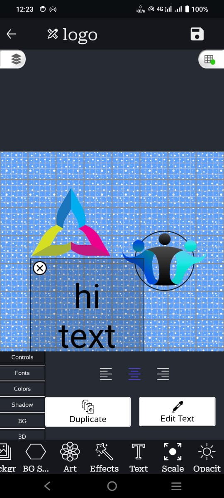
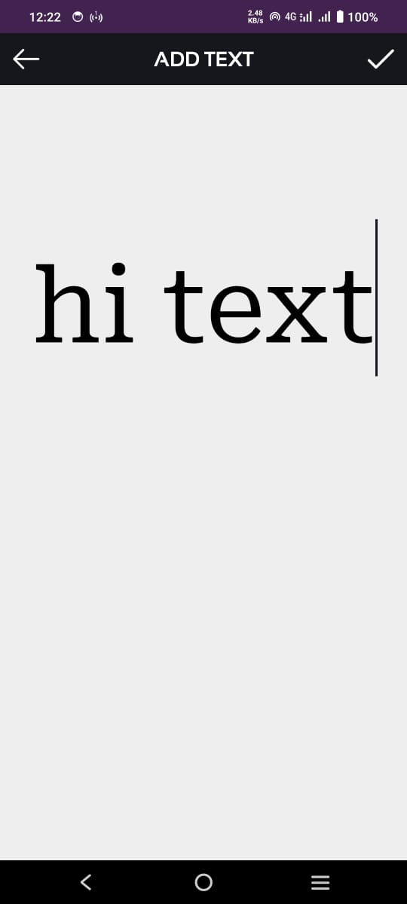
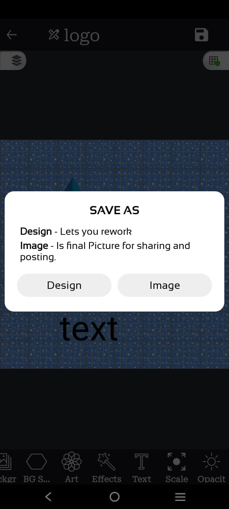
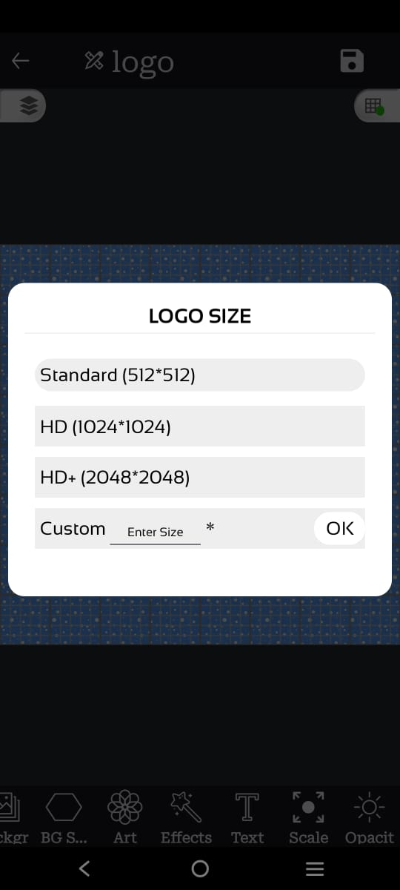
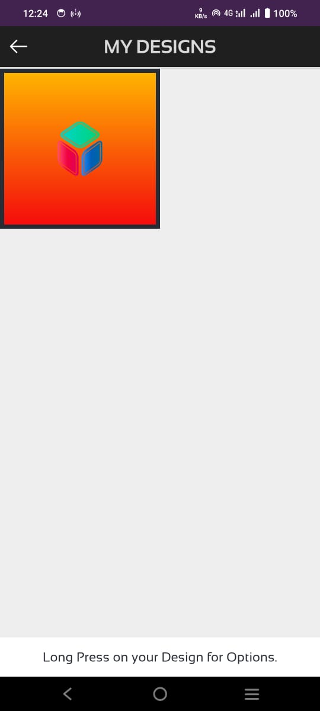
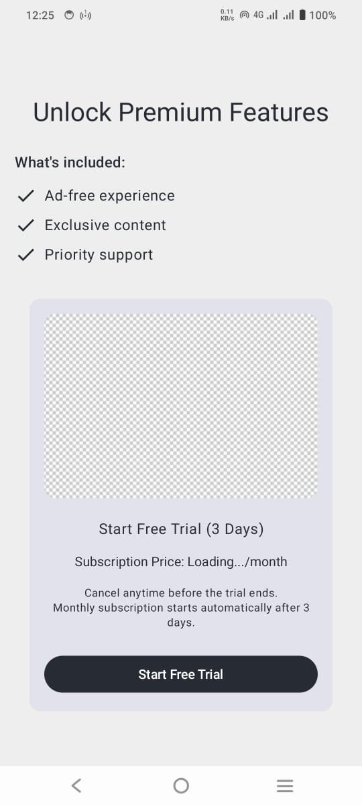

<h1 align="center">Graphics Maker</h1>

Graphics Maker: the very last word in graphics , card , logo and icon making

  

## Screenshots

## Design principles

* Be as beautiful and easy to use as possible without sacrificing security or
  privacy

## Features

* upload and download images
* user can save design so later he/she can work on it
* there are a lot of built in available beautifully assets , you will really love them. 
* Share your creation
* Intuitive UI that follows Android Design guidelines
* Multiple asset builtin
* Very low impact on battery life

## FAQ

### General

#### How do I install app

contact me: hhasnain777@gmail.com to get your key to build the app

